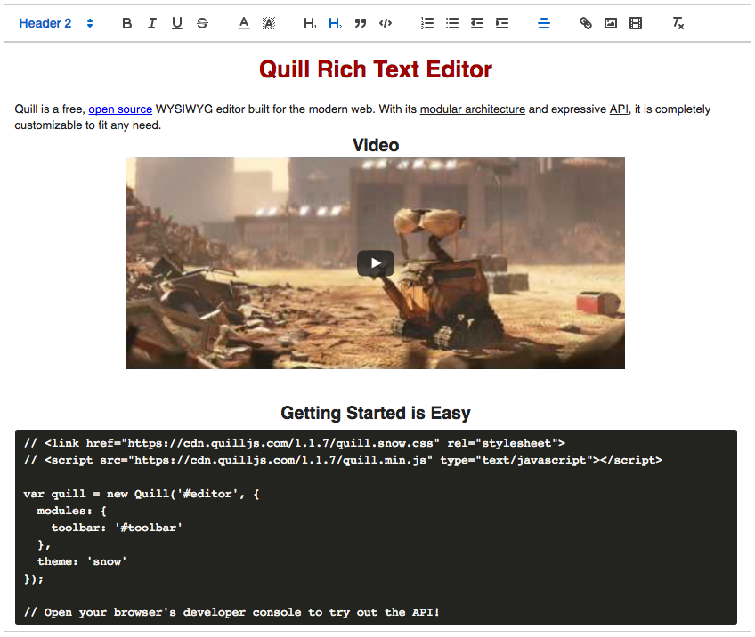

[](https://beta.webcomponents.org/element/PolymerElements/paper-button)
[](https://travis-ci.org/chuckh/polymer-quill)

# \<polymer-quill\> 

## Polymer Quill Rich Text Editor

- `<polymer-quill>` element creates a Polymer Quill Rich Text Editor using the Snow Theme.
- `<polymer-quill-bubble>` element creates a Polymer Quill Rich Text Editor using the Bubble Theme (popup toolbar like Medium).
- `<polymer-quill-html-render>` element creates a Polymer Quill HTML Render

Quill is a free, open source WYSIWYG editor built for the modern web.
With its modular architecture and expressive API, it is completely customizable to fit any need.
Learn more at http://quilljs.com/

### Screenshot Snow Theme


### Example:
<!---
```
<custom-element-demo>
  <template>
    <script src="../webcomponentsjs/webcomponents-lite.js"></script>
    <script>
      window.Polymer = {
        dom: 'shady',
        lazyRegister: true
      };
    </script>
    <link rel="import" href="polymer-quill.html">
    <link rel="import" href="polymer-quill-bubble.html">
    <link rel="import" href="polymer-quill-html-render.html">
    <style is="custom-style">
      #container {
        display: flex;
      }
    </style>
    <div id="container">
      <next-code-block></next-code-block>
    </div>
    <script>
      // Setup Polymer options
      window.Polymer = {
        dom: 'shady'
      };
    </script>
  </template>
</custom-element-demo>
```
-->
```html
<polymer-quill content="Hello World"></polymer-quill>
<polymer-quill-bubble content="Hello World (click text to see toolbar)" show-results></polymer-quill-bubble>    
<polymer-quill-html-render content='<h2 class="ql-align-center">Hello World</h2>'></polymer-quill-html-render>
```

## Demo and API docs
If your are viewing this from webcomponents.org, use this links for API and demos, not the links on right sidebar.

- [API docs](https://chuckh.github.io/polymer-quill/)
- [Demo Snow Toolbar](https://chuckh.github.io/polymer-quill/components/polymer-quill/demo/)
- [Demo Bubble Toolbar (Medium style)](https://chuckh.github.io/polymer-quill/components/polymer-quill/demo/bubble.html)
- [Demo Quill HTML Render](https://chuckh.github.io/polymer-quill/components/polymer-quill/demo/html-render.html)

### Examples

#### Defaults (stores as Deltas every 2 seconds, does not show results, 50px height)

    <polymer-quill content="Hello World"></polymer-quill>

#### Defaults (stores as Deltas every 2 seconds, does not show results, 50px height)

    <polymer-quill-bubble content="Hello World (click text to see toolbar)"></polymer-quill-bubble>    

#### Custom (stores as HTML every 5 seconds, show results)

    <polymer-quill content="Hello World" store-as="html" store-interval="5000" show-results></polymer-quill>

#### Custom (stores as HTML every 5 seconds, show results)

    <polymer-quill-html-render content="<h2 class="ql-align-center">Hello World</h2>"></polymer-quill-html-render>


#### Demo example

```html
<style is="custom-style">
  polymer-quill.full {
    --polymer-quill-editor-max-height: 300px;
    --polymer-quill-editor-min-height: 100px;
  }
</style>
<h2>Full Toolbar, Show Results, Max Height (300px), Min Height (100px), Save as Deltas, Save every 1 second</h2>
<polymer-quill content='{"ops":[{"insert":"Hello World! - Store as Delta"},{"attributes":{"header":2},"insert":"\n"}]}'
  class='full'
  store-as="delta"
  save-interval="1000"
  toolbar-type="full"
  show-results>
</polymer-quill>
<h2>Standard Toolbar, Hide Results, Default height (100px), Save as HTML, Save every 2 seconds</h2>
<polymer-quill content="<h2>Hello World! - Store as HTML</h2>" store-as="html"></polymer-quill>
```

## Styling

The following custom properties and mixins are available for styling. This allows the editor auto grow to the max-height.:

### polymer-quill  (Snow theme)
Also had to make editor have `padding-bottom: 50px` to have link popup show.

Custom property | Description | Default
----------------|-------------|----------
`--polymer-quill-editor-max-height` | Custom max-height for editor     | `400px`
`--polymer-quill-editor-min-height` | Custom max-height for editor     | `50px`
`--polymer-quill-editor-overflow`   | Custom overflow for editor       | `scroll`
`--polymer-quill-editor-border`     | Custom min-height for editor     | `solid 1px #ccc`
`--polymer-quill`                   | Mixin applied to the editor      | `{}`

Below is example of setting the editor to `max-height` of 260px less then the viewport height and `min-height` of 150px. So any content greater then the max-height with scroll otherwise it will auto grow.

```
polymer-quill {
  --polymer-quill-editor-max-height: calc(100vh - 260px);
  --polymer-quill-editor-min-height: 150px;
  max-width: 870px;
  box-shadow: 0 2px 2px 0 rgba(0, 0, 0, 0.14), 0 1px 5px 0 rgba(0, 0, 0, 0.12), 0 3px 1px -2px rgba(0, 0, 0, 0.2);
  padding: 0;
  margin-left: auto;
  margin-bottom: 5px;
  margin-right: auto;
  border-radius: 5px;
  background-color: #fff;
  color: #212121;
}
```

### polymer-quill-bubble  (Bubble theme)

Max-height needs to be set for bubble popup toolbar to work with is default. 
Also had to make editor have `padding-bottom: 50px` so toolbar displays for last line.

Custom property | Description | Default
----------------|-------------|----------
`--polymer-quill-editor-max-height` | Custom max-height for editor     | `auto`
`--polymer-quill-editor-min-height` | Custom min-height for editor     | `50px`
`--polymer-quill-editor-overflow`   | Custom overflow for editor       | `scroll`
`--polymer-quill-editor-border`     | Custom min-height for editor     | `solid 1px #ccc`
`--polymer-quill`                   | Mixin applied to the editor      | `{}`

## Install

    bower install --save polymer-quill

### Polymer Starter Kit 2

If you are using Polymer Starter Kit 2 or like as the bases of your app you will need to change `dom: 'shadow'` to `dom: 'shady'` like below. Otherwise the Polymer Quill Editor will not display.

```javascript
  // Setup Polymer options
  window.Polymer = {
    dom: 'shady',
    lazyRegister: true
  };
```

## License

### The MIT License (MIT)
Copyright (c) 2016 Chuck Horton

Permission is hereby granted, free of charge, to any person obtaining a copy of this software and associated documentation files (the "Software"), to deal in the Software without restriction, including without limitation the rights to use, copy, modify, merge, publish, distribute, sublicense, and/or sell copies of the Software, and to permit persons to whom the Software is furnished to do so, subject to the following conditions:

The above copyright notice and this permission notice shall be included in all copies or substantial portions of the Software.

THE SOFTWARE IS PROVIDED "AS IS", WITHOUT WARRANTY OF ANY KIND, EXPRESS OR IMPLIED, INCLUDING BUT NOT LIMITED TO THE WARRANTIES OF MERCHANTABILITY, FITNESS FOR A PARTICULAR PURPOSE AND NONINFRINGEMENT. IN NO EVENT SHALL THE AUTHORS OR COPYRIGHT HOLDERS BE LIABLE FOR ANY CLAIM, DAMAGES OR OTHER LIABILITY, WHETHER IN AN ACTION OF CONTRACT, TORT OR OTHERWISE, ARISING FROM, OUT OF OR IN CONNECTION WITH THE SOFTWARE OR THE USE OR OTHER DEALINGS IN THE SOFTWARE.


